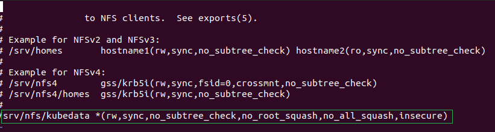

##  Install the NFS kernel Server package
```
sudo apt update
sudo apt install nfs-kernel-server
```

## Create an NFS directory share
```
sudo mkdir /srv/nfs/kubedata -p
sudo chown nobody:nogroup /srv/nfs/kubedata
```

## Allow NFS client access to NFS server

edit  /etc/exports file

```
sudo vi /etc/exports

```


## Export the shared directory
```
sudo exportfs -arv

lb@ubuntu:~$ sudo exportfs -v
[sudo] password for lb: 
/srv/nfs/kubedata
		<world>(rw,wdelay,insecure,no_root_squash,no_subtree_check,sec=sys,rw,insecure,no_root_squash,no_all_squash)

```

## Test nfs server

### install nfs client
```
sudo apt install nfs-common
```
### mount nfs server shared folder
```
mount -t nfs <nfs-server-ip>:/srv/nfs/kubedata /mnt
```
### check if mount successfully
```
$ mount | grep kubedata
192.168.186.133:/srv/nfs/kubedata on /mnt type nfs4 (rw,relatime,vers=4.2,rsize=524288,wsize=524288,namlen=255,hard,proto=tcp,timeo=600,retrans=2,sec=sys,clientaddr=192.168.186.132,local_lock=none,addr=192.168.186.133)

```
